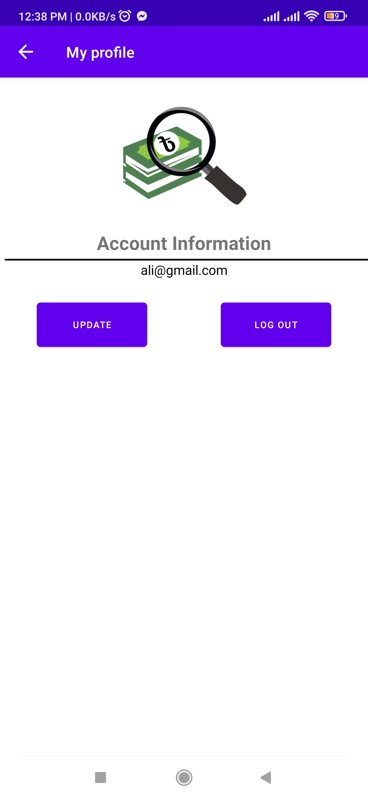
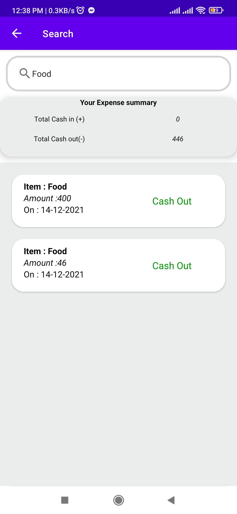
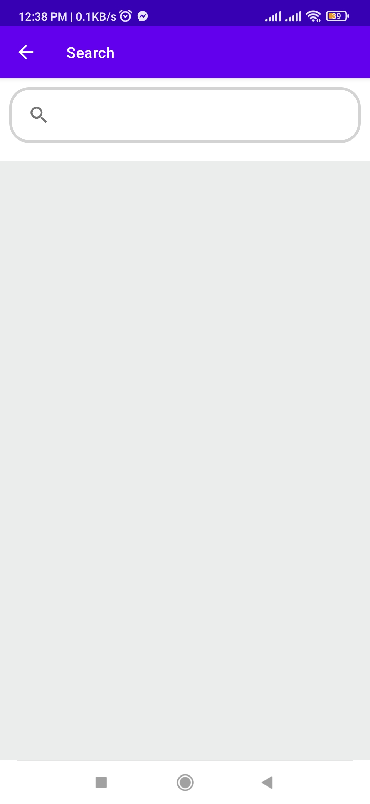
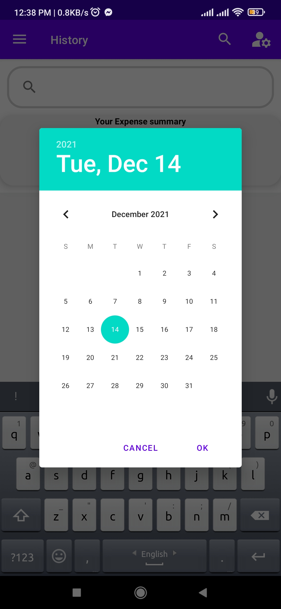
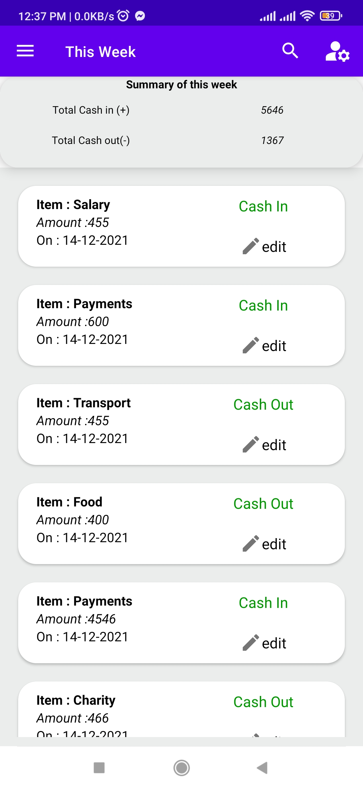
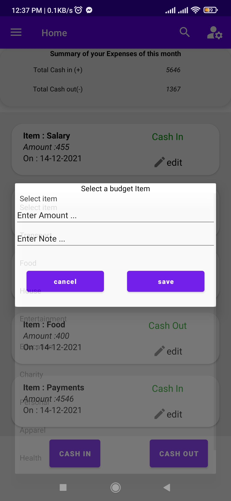
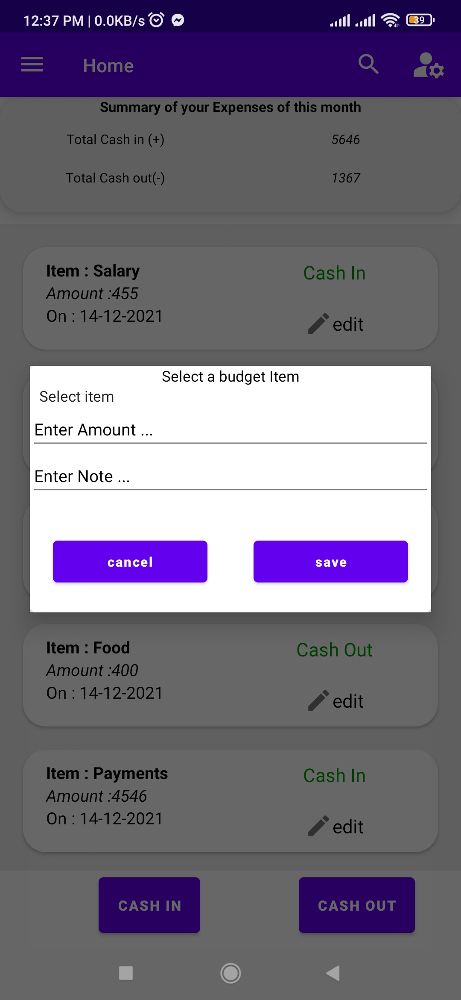
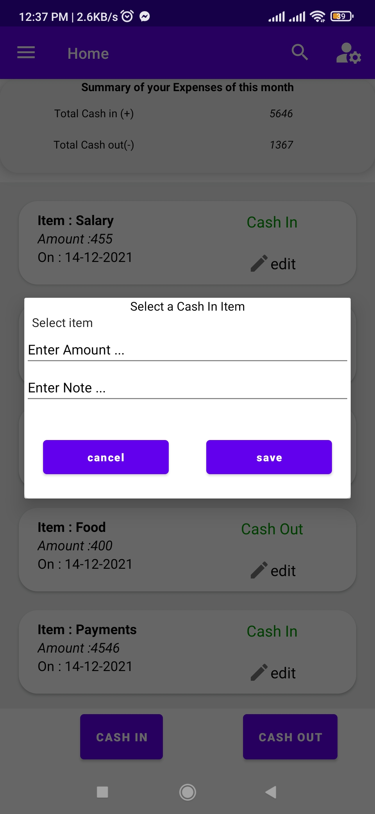
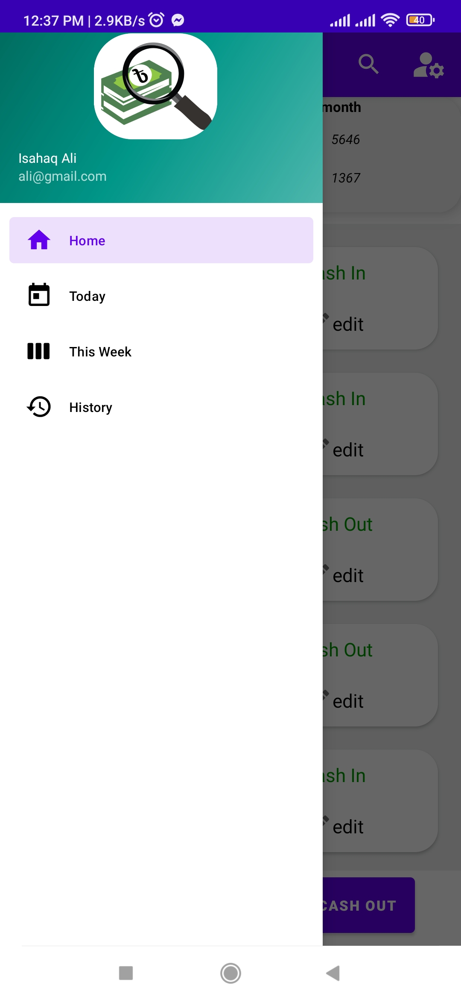

## Why did we do this project ?

we did this project so that, 
- Users can keep track of their montly expenses.
- Users account management can be easy and simple.
- Users can know their cash flow & workbook balance.
- Users can use this app as their expense manager.
- Users can keep a track of their pocket money.

## Features

- Real-time calculations of cash-ins and cash-outs.
-  User can categorize their expenses.
- Users can find a record of all cash in and cash-out transactions associated with the remark item.
- User can apply filter based search and get filter based record on board.

## How to Use it ?

- After installing the application, you will have a splash screen while opening the application. 

- Sign up with an email and login with the application.

- After having all these done, you will know how to go through next steps. 

## How to configure this project on your machine ?

- Install Android Studio.
- Clone this project from github repository created already.
- After having these done, just open android studio on your machine and open the  cloned project folder.
- Connect to the firebase. 
- Run the application using the android studio utilities.
- That's all. 

## Screen-Shots

## presentation-video
https://youtu.be/u7eZYw9d84w

## Application video

https://user-images.githubusercontent.com/51034527/145967453-d3c4e8df-a95c-4507-a63b-88d688c9a6e0.mp4

